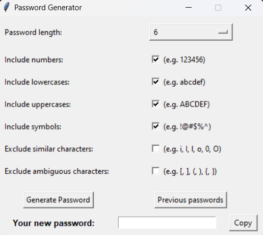
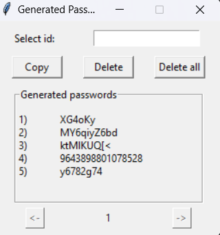

# Password Generator Using Python

A tool that generates passwords based on the options (e.g. including numbers, including symbols, excluding similar characters, and etc) that users set. It helps the users to create passwords that fit different sites' unique password requirements and automatically saves the generated passwords for users.

## Package Required

In order to use this password generator, you need to install one Python library. Using [pip](https://pip.pypa.io/en/stable/) to install the pyperclip library:
```
pip install pyperclip
```

## Features Included

* Different options to control how you want to generate your password in order to fit different sites' password requirements.
* Options to filter out similar characters and ambiguous characters to make the generated passwords less confusing.
* Generated passwords will be store locally (when you generate you first password, a file called "passwords.db" will automatically be created under the same folder to store the generated passwords) and users are allowed to do operations (copy passwords generated in the past and delete the passwords that no longer needed) on those passwords.

## Executing program

* Run the "run_generator.py" file using Python and you will see the follow window pops up:

    

    This is the main page of this program. In this page, you can control how you want to generate your passwords.

* You could check the passwords that the program generated previously by clicking the "Previous passwords" button. This will pop up an new window which looks like the following:
   
    

    As the image shown, each password is associated to an unique id shown on their left. Enter the id of the password that you want to operate in the entry box, and then you will be able to either copy that password or delete it from the database. You could also delete all of the generated passwords by clicking the "Delete all" button.
